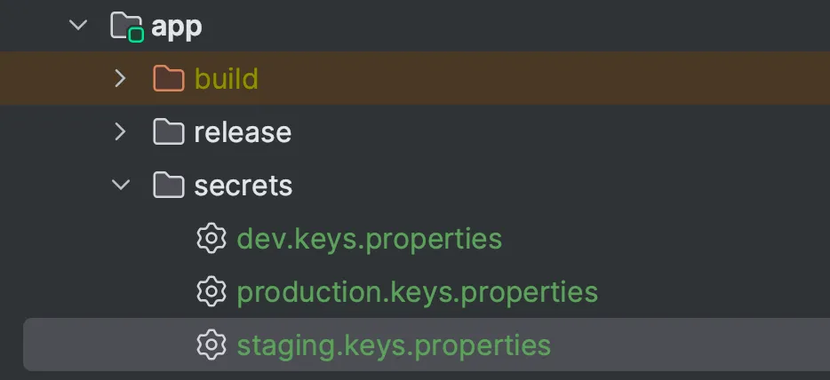

# Secure API Key Management with ApiKeysGeneratorPlugin in Kotlin and Android Projects

Modern Android development often requires embedding API keys (e.g., for Firebase, Google Maps, or third-party services) in your project. Hardcoding keys in `build.gradle` or source code paths risks accidental exposure in version control or builds. The [**ApiKeysGeneratorPlugin**](https://plugins.gradle.org/plugin/com.fatherofapps.api-key-generator) solves this by centralizing keys, generating typed Kotlin accessors, and keeping secrets out of version control.


---

## How does it solve the problem?

The plugin works based on a Gradle-based code generation approach:

1. **Input**: The plugin accepts API keys as key-value pairs, for example: `mainServerKey=xyzt`. You can provide these inputs either via the command line or from a file.

    - **Command line**: You can store API keys securely in the cloud or in your CI/CD environment (e.g., GitHub Secrets), then pass them as parameters when running the Gradle task. This approach keeps secrets out of source code and works well in automated pipelines.

    - **File input**: You can store keys in a plain-text `.properties` file (e.g., `apikeys.properties`) and exclude it from version control via `.gitignore` to keep it secure.

2. **Gradle task**: The plugin registers a custom Gradle task that reads the keys from the file or command line, then generates a Kotlin source file with constants or properties.

3. **Secure build-time injection**: During compilation, the generated source file is included in your project’s source set. You can access API keys using strongly typed constants like `ApiKeys.GOOGLE_MAPS_KEY` instead of hardcoded strings.

4. **Customization support**: You can configure package name, class name, output path, and even define custom encryption logic for the values—making the plugin highly adaptable.

---

## Basic usage

### Apply the plugin

In your `build.gradle.kts`:

```kotlin
id("com.fatherofapps.api-key-generator") version "latest_version"
```
Check for the latest version in [here](https://github.com/frank-nhatvm/ApiKeysGeneratorPlugin/releases).

Configure the plugin:
```kotlin
apiKeyGenerator {
        outPut {
            apiKeyClassName = "your_class_name"
            apiKeyFile =layout.projectDirectory.file("your_file")
            outPutPackageName = "your_packge_name"
        }
    }
```
Notice: You should add the generated file to the `.gitignore`

Sync the pro, then run
```bash
./gradlew generateApiKey --apiKeyNames=your_apikey_name --apiKeyValues=your_apikey_value
```
For the CI/CD, first you need to add your ApiKey’s value to GitHub Secret, then add a new step in your Github Action:
```yaml
- name: Generate ApiKey
  run: |
    ./gradlew generateApiKey -apiKeyNames=your_apikey_name --apiKeyValues=${{ secrets.API_KEY_VALUE }}
```
The generated file:
```kotlin
package your_package_name
internal object your_class_name{
  val your_apikey_name: ByteArray = byteArrayOf(0x6B,0x65,0x79,0x2D,.....)
}
```
To convert back to the raw key and use in code, you can implement a `ApiKeyProvider`  class and use `String(bytearray)` .
```kotlin
object  ApiKeyProvider{
    fun your_apikey_name() = String(your_class_name.your_apikey_name)
}
```

# Providing the Apikey in a file

In development, you maybe want to provide the Apikey in a file. The common scenario is

- Your company/team stores all the Apikey in a cloud. (Eg: Bitwarden)
- You are granted the permission to copy the ApiKey
- You create a file with the ApiKey’s name and ApiKey’s value, add this file to the `.gitignore`

In your project, you can create a folder to keep this file. By default, the Plugin expects each ApiKey in a pair of key and value is provide in a line and in `key=value` format. If you want to customize this format, check Customize how to read the input file section   A sample file:
```json
//rootProject/secrets/keys.properties
apiKeys=your_raw_key_in_plain_text
```

Next step, you need to update the Plugin’s configuration:
```kotlin
apiKeyGenerator {
        outPut {
            apiKeyClassName = "your_class_name"
            apiKeyFile =layout.projectDirectory.file("your_file")
            outPutPackageName = "your_packge_name"
        }
        input {
            keyFile = layout.projectDirectory.file("secrets/keys.properties")
        }
    }
```
Do the sync, then run:
```bash
./gradlew generateApiKey
```

## Working with Flavor

If your project uses multiple flavors, you can create a separate API key file for each flavor and configure the input file by Flavor. Below is a sample configuration for an Android project with `dev`, `staging`, and `production` flavors:
```kotlin
android {
flavorDimensions += "default"
    productFlavors {

        create("production") {

        }
        create("dev") {

        }

        create("staging") {

        }

    }

    val flavorName = project.findProperty("flavor") as? String ?: "dev"

    apiKeyGenerator {
        outPut {
            apiKeyClassName = "ApiKeys"
            apiKeyFile =
                layout.projectDirectory.file("src/main/java/com/fatherofapps/demojnav/data/security/ApiKey.kt")
            outPutPackageName = "com.fatherofapps.demojnav.data.security"
        }
        input {
            keyFile = layout.projectDirectory.file("secrets/$flavorName.keys.properties")
        }
    }

}
```

The secrets folder:


Then to generate the key, you run as below:
```bash
./gradlew generateApiKey -Pflavor=flavor_name // dev, staging or production
```

# Customize how to read the input file

When the ApiKey is provide in a file, the Plugin reads each line of that file and parse for a pair of key and value. The default format for each line is `key=value` , if you want to use a different format for each line of your input file, you can provide a  `FAReadLine` implementation
```kotlin
interface FAReadLine{
     fun readLine(line: String): Pair<String, String> {
        
    }
}
```

The flow:

- The Plugin read one line of ApiKey file
- The Plugin calls your custom `FAReadLine`  and pass the line in String
- Your custom `FAReadLine`  returns a `Pair<String,String`

A sample of implementing a custom `FAReadLine`  and how to configure it:
```kotlin
// build.gradle.kts

 
 class CustomReadlineType : FAReadLine{
    override fun readLine(line: String): Pair<String, String> {
         val list = ......

        return Pair(list[0], list[1])
    }
}

apiKeyGenerator{
   //... other configurations

    input {
        keyFile = layout.projectDirectory.file("secrets/keys.properties")
        readLineType.set(CustomReadlineType())
    }
}
```

# Customize the encryption algorithm

The generated output  will look like below:
```kotlin

val apiKey: ByteArray = byteArrayOf(0x6B,0x65,0x79,0x2D,0x70,0x72,0x6F,0x64,0x75,0x63,0x74,0x69,0x6F,0x6E)
```
The steps to generate that result in Plugin:

- Step 1: ApiKey’s value in String will be converted to `ByteArray` by using `toByteArray` function of `String`
  - Step 2: The Apikey’s name and the Apikey’value in ByteArray of step one will go to the following function:

```kotlin
              private fun generateByteArrayCode(name: String, byteArray: ByteArray): String {
              val hexValues = byteArray.joinToString(",") { "0x" + it.toUByte().toString(16).uppercase() }
              return "val $name: ByteArray = byteArrayOf($hexValues)"
              }  
```
If you wan to use another encryption algorithm to convert Apikey’s value in String to ByteArray  in step 1, you can implement a custom FAEncrypt 
```kotlin
interface FAEncrypt{
     fun encrypt(key: String): ByteArray {

    }
}
```
The flow will look like this:

The sample how you implement FAEncrypt  and add it to the configuration:
```kotlin
// build.gradle.kts

class CustomFAEncrypt: FAEncrypt{
    override fun encrypt(key: String): ByteArray {
        return Base64.getEncoder().encode(key.toByteArray())
    }
}

apiKeyGenerator{
   outPut {
   // ... other configurations
   encryptType.set(CustomFAEncrypt())
   }
}
```

You will need to use your appropriate decryption algorithm for your encryption algorithm, when you want to convert the Apikey’s value from ByteArray  to raw value:
```kotlin
object  ApiKeyProvider{
    fun your_apikey_name() = String( Base64.decode(apiKey, Base64.DEFAULT))
    
  }  
```